<div align="center">

<a href="https://github.com/Timid-tec">
  
</a>

<sub><code>SERVER-SIDE SOFTWARE</code> &nbsp;/&nbsp; <code>COMMUNITY INFRASTRUCTURE</code> &nbsp;/&nbsp; <code>CS:GO</code></sub>

</div>

## `01 / IDENTITY`

I build **SourceMod plugins for Counter-Strike: Global Offensive** and host CS:GO servers on the side.

That puts me on both sides of the console: I write the code, then run it against real players, strange configs, full servers, bad actors, database failures, and every edge case that only appears at 2 AM.

> A plugin is not finished when it compiles. It is finished when it survives the server.

| I BUILD | I OPERATE | I CARE ABOUT |
| :--- | :--- | :--- |
| SourcePawn plugins | CS:GO community servers | Stability under live traffic |
| Admin and player systems | MetaMod + SourceMod stacks | Clear configuration |
| Anti-cheat diagnostics | Databases and webhooks | Useful documentation |

## `02 / REQUEST PATH`

```text
 PLAYER
   └── CS:GO SERVER
        └── METAMOD:SOURCE
             └── SOURCEMOD
                  └── PLUGIN
                       ├── gameplay response
                       ├── administrator action
                       ├── SQLite / MySQL
                       ├── Discord webhook
                       └── logs + evidence
```

I work across that entire path: gameplay rules, HUDs, menus, commands, moderation workflows, storage, diagnostics, packaging, deployment, and the inevitable post-deploy fix.

## `03 / PLUGIN RACK`

Nine public modules. Each one exists because a live server needed something sharper.

| SLOT | MODULE | ROLE |
| :--: | :--- | :--- |
| `00` | **[Eclipse Anti-Cheat](https://github.com/Timid-tec/Eclipse-Anti-Cheat)** | Low-false-positive, server-side detection with evidence chains, live admin diagnostics, spectator HUDs, and private forensic overlays. |
| `01` | **[Advanced Reports](https://github.com/Timid-tec/Advanced-Reports)** | In-game player reports with SQLite or MySQL storage, admin actions, cooldowns, and optional Discord alerts. |
| `02` | **[Advanced Spawn Protection](https://github.com/Timid-tec/Advanced-Spawn-Protection)** | Configurable spawn immunity with a layered countdown HUD, attack cancellation, warnings, and optional model effects. |
| `03` | **[Quick Command Menu](https://github.com/Timid-tec/Quick-Command-Menu)** | A config-driven in-game menu for commands, private chat output, safe reloads, and quick server navigation. |
| `04` | **[ClanTag Checker](https://github.com/Timid-tec/ClanTag-Checker)** | Detects configured Steam clan tags and applies the server's chosen replacement tag. |
| `05` | **[Disable Radar](https://github.com/Timid-tec/Disable-Radar)** | Gives operators a simple server-side control for the CS:GO radar. |
| `06` | **[Random Health](https://github.com/Timid-tec/Random-Health)** | Adds configurable randomized health behavior for custom game modes. |
| `07` | **[Weapon Restrict](https://github.com/Timid-tec/Weapon-Restrict)** | Provides server-side weapon restriction for controlled gameplay. |
| `08` | **[Weapon Restrict Map](https://github.com/Timid-tec/Weapon-Restrict-Map)** | Adds map-aware weapon restrictions and removes the actual equipped restricted item. |

## `04 / FLAGSHIP SYSTEM — ECLIPSE`

**Eclipse** is the project where server operations and plugin engineering collide hardest. It is built to gather evidence instead of reacting to a single noisy signal.

```text
COMMAND TICKS ──> DETECTOR CHAINS ──> SUSPICION SCORE ──> ADMIN EVIDENCE
      │                  │                    │                   │
   observe          require repeats       apply policy       inspect live
```

It watches aim, anti-aim, command integrity, networking, movement, and firing behavior while accounting for latency and combat-surf physics. Admins get live status, detailed evidence, spectator diagnostics, and private forensic tools—the information needed to make a decision, not just a red light.

## `05 / THE NIGHT SHIFT`

Running servers on the side keeps the work honest. The loop looks like this:

```text
BUILD  >  COMPILE  >  PACKAGE  >  DEPLOY  >  OBSERVE  >  PATCH  >  DOCUMENT
  ^                                                                         |
  └─────────────────────────────────────────────────────────────────────────┘
```

- compile and package SourcePawn plugins for repeatable installation;
- tune server configs and reload systems without unnecessary downtime;
- trace player reports, logs, database state, and detector evidence;
- protect the hot path when logic runs every command tick;
- turn the fix into documentation so the next operator does not have to guess.

<details>
<summary><code>open operator.log</code></summary>
<br />

The part I enjoy most is making invisible infrastructure feel solid. Players should notice the experience—not the work keeping it together. Admins should have the right controls when something goes wrong. Operators should be able to understand a plugin without reverse-engineering it first.

</details>

## `06 / TOOLCHAIN`

<div align="center">


</div>

---

<div align="center">

[](https://github.com/Timid-tec?tab=repositories)

<br />

<code>STATUS: ONLINE</code><br />
<sub>Keep the server sharp. Keep the evidence clear. Keep the old game alive.</sub>

</div>
